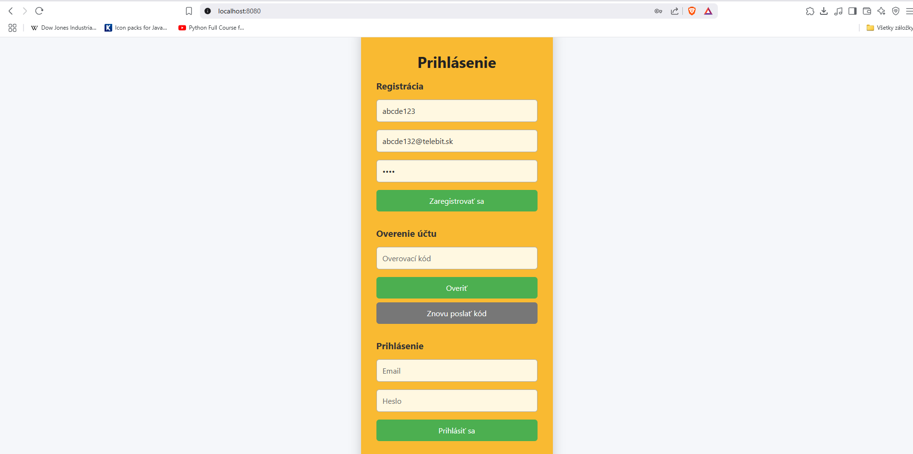
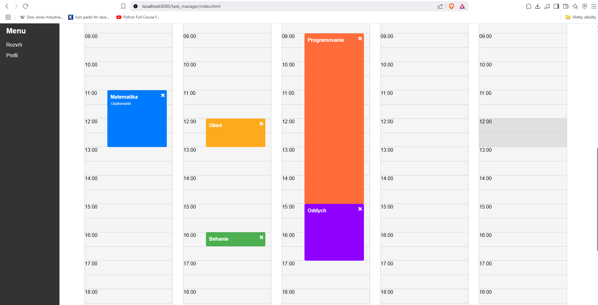
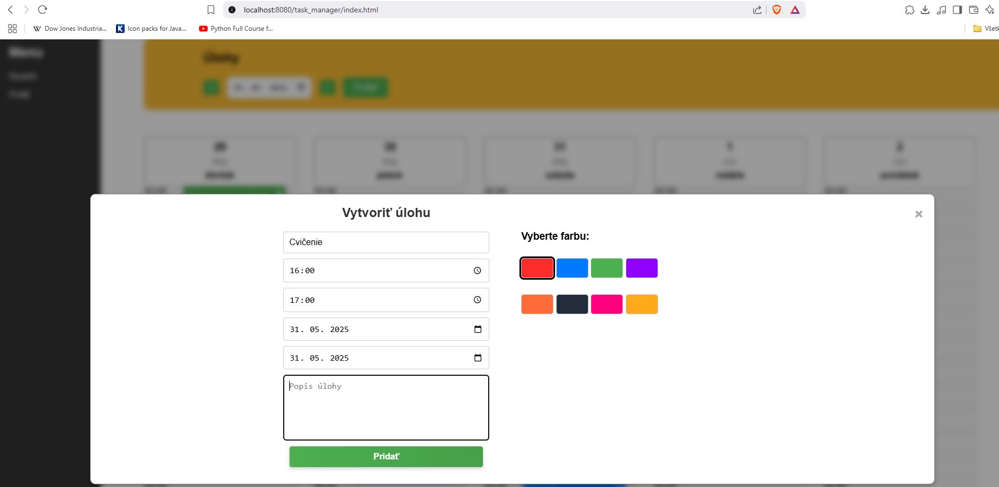
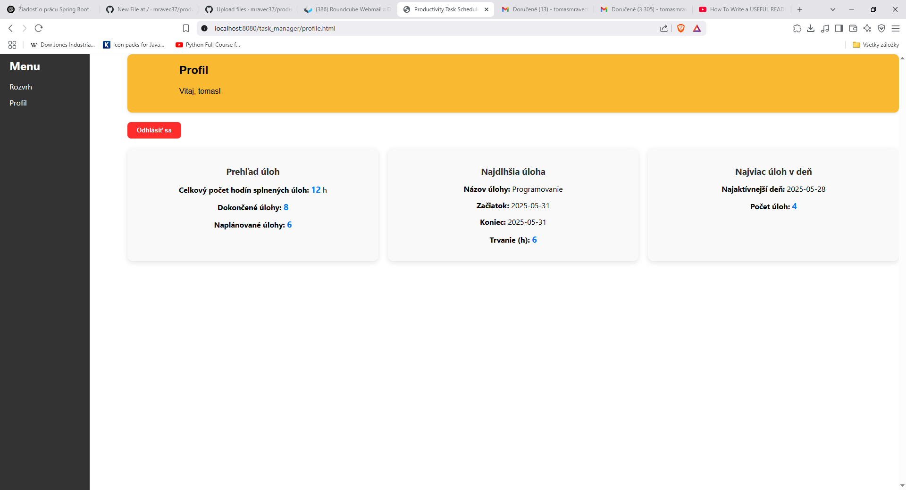

# 🗓️ ProductivityApp

Webová aplikácia na správu denných úloh s overením e-mailu, štatistikami. Frontend komunikuje so Spring Boot Backendom pomocou REST API.  

---

## 🔗 Vyskúšajte aplikáciu

Link: [Kliknite sem a vyskúšajte ProductivityApp](https://e0da7445882a.ngrok-free.app).

Registrácia pomocou gmail ešte nie je možná.

Môžete sa prihlásiť s účtom:

- **Email:** login@telebit.sk
- **Heslo:** 290303

---

## ✨ Funkcionalita

- ✅ Registrácia používateľa cez e-mail.
- 📧 Overenie cez kód zaslaný na e-mail.
- 📝 Vytváranie úloh (taskov) na konkrétny dátum a čas pre konkrétneho užívateľa.
- ❌ Ak sa nový task časovo prekrýva s existujúcim, nebude vytvorený.
- ✏️ Úprava taskov – premenovanie, zmena času, zmena farby.
- 🗑️ Mazanie taskov.
- 👤 Profilová stránka používateľa s prehľadnými štatistikami.
- 🚪 Odhlásenie z aplikácie.

---

## 🖼️ Náhľady aplikácie

---

## 🛠️ Použité technológie

- **Backend:** Spring Boot (Java)
- **Frontend:** JavaScript, HTML, CSS
- **Databáza:** MySQL
- **Autentifikácia:** JWT tokeny
